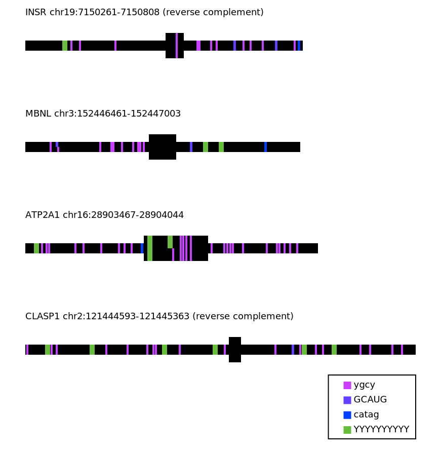

# motif-mark
The purpose of this script is to visualize a series of motifs on a series of sequences, each containing one exon flanked by introns. The sequences are input as fasta files with the command line argument `-f`. The exons are denoted by capital letters, the introns lowercase. The motifs are input in a separate txt file with one motif per line, using the command line argument `-m`. Ambiguous bases are permitted, expressed using [IUPAC nucleic acid notation](https://en.wikipedia.org/wiki/Nucleic_acid_notation). The drawing created by the script will have the same file prefix as the fasta file, and be saved as a PNG. The exons are are denoted by a wider rectangle, the introns a narrower rectangle, and each motif is color-coded and appears as written in the txt file within a key in the lower right hand corner of the figure. If more than five motifs are entered at a time, the color code may be become ambiguous. Where motifs overlap, they are vertically shortened to show the full extent of overlap. See below for an example:


## Usage
To run via the command line, specify arguments as follows:
```./motif-mark-oop.py -f "<sequence file>.fasta" -m "<motif file>.txt"```

# Dependencies 
The visualization is created using python version 3.13.2, and the drawing package pycairo version 1.27.0.
